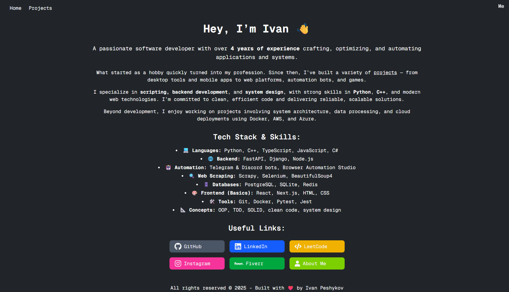

This project is a personal application built with Next.js, TypeScript, and React.

### Features

- Page with links and short description of my skills
- Page with projects with descriptions and images
- My personal page with a list of my goals and some other features in future

### Main page



### Run it Locally

1. Install dependencies:
   ```bash
   npm install
   ```
2. Start the development server:
   ```bash
   npm run dev
   ```
3. Open [http://localhost:3000](http://localhost:3000) in your browser.

### Notes

- Set the `NEXT_PUBLIC_API_URL` environment variable in `.env.local` for API access.
